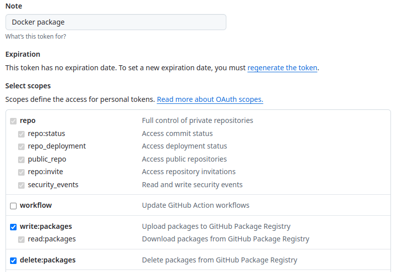

# Criando uma imagem no GHCR

## Criando a imagem

```bash
docker build -t static-site .
```

Para verificar se a imagem foi criada:

```bash
docker images
```

Resultado esperado:

```bash
docker images
REPOSITORY                            TAG       IMAGE ID       CREATED             SIZE
static-site                           latest    076fd4f6c08a   About an hour ago   117MB
```

Para testar a imagem, use o comando `docker run -p <host_port>:<container_port>`

```bash
docker run -p 80:80 static-site
```

## Gerando o PAT (Personal Access Token)

> Extraído de https://docs.github.com/en/authentication/keeping-your-account-and-data-secure/managing-your-personal-access-tokens

1. Verify your email address, if it hasn't been verified yet.

1. In the upper-right corner of any page on GitHub, click your profile picture, then click <svg version="1.1" width="16" height="16" viewBox="0 0 16 16" class="octicon octicon-gear" aria-label="gear" role="img"><path d="M8 0a8.2 8.2 0 0 1 .701.031C9.444.095 9.99.645 10.16 1.29l.288 1.107c.018.066.079.158.212.224.231.114.454.243.668.386.123.082.233.09.299.071l1.103-.303c.644-.176 1.392.021 1.82.63.27.385.506.792.704 1.218.315.675.111 1.422-.364 1.891l-.814.806c-.049.048-.098.147-.088.294.016.257.016.515 0 .772-.01.147.038.246.088.294l.814.806c.475.469.679 1.216.364 1.891a7.977 7.977 0 0 1-.704 1.217c-.428.61-1.176.807-1.82.63l-1.102-.302c-.067-.019-.177-.011-.3.071a5.909 5.909 0 0 1-.668.386c-.133.066-.194.158-.211.224l-.29 1.106c-.168.646-.715 1.196-1.458 1.26a8.006 8.006 0 0 1-1.402 0c-.743-.064-1.289-.614-1.458-1.26l-.289-1.106c-.018-.066-.079-.158-.212-.224a5.738 5.738 0 0 1-.668-.386c-.123-.082-.233-.09-.299-.071l-1.103.303c-.644.176-1.392-.021-1.82-.63a8.12 8.12 0 0 1-.704-1.218c-.315-.675-.111-1.422.363-1.891l.815-.806c.05-.048.098-.147.088-.294a6.214 6.214 0 0 1 0-.772c.01-.147-.038-.246-.088-.294l-.815-.806C.635 6.045.431 5.298.746 4.623a7.92 7.92 0 0 1 .704-1.217c.428-.61 1.176-.807 1.82-.63l1.102.302c.067.019.177.011.3-.071.214-.143.437-.272.668-.386.133-.066.194-.158.211-.224l.29-1.106C6.009.645 6.556.095 7.299.03 7.53.01 7.764 0 8 0Zm-.571 1.525c-.036.003-.108.036-.137.146l-.289 1.105c-.147.561-.549.967-.998 1.189-.173.086-.34.183-.5.29-.417.278-.97.423-1.529.27l-1.103-.303c-.109-.03-.175.016-.195.045-.22.312-.412.644-.573.99-.014.031-.021.11.059.19l.815.806c.411.406.562.957.53 1.456a4.709 4.709 0 0 0 0 .582c.032.499-.119 1.05-.53 1.456l-.815.806c-.081.08-.073.159-.059.19.162.346.353.677.573.989.02.03.085.076.195.046l1.102-.303c.56-.153 1.113-.008 1.53.27.161.107.328.204.501.29.447.222.85.629.997 1.189l.289 1.105c.029.109.101.143.137.146a6.6 6.6 0 0 0 1.142 0c.036-.003.108-.036.137-.146l.289-1.105c.147-.561.549-.967.998-1.189.173-.086.34-.183.5-.29.417-.278.97-.423 1.529-.27l1.103.303c.109.029.175-.016.195-.045.22-.313.411-.644.573-.99.014-.031.021-.11-.059-.19l-.815-.806c-.411-.406-.562-.957-.53-1.456a4.709 4.709 0 0 0 0-.582c-.032-.499.119-1.05.53-1.456l.815-.806c.081-.08.073-.159.059-.19a6.464 6.464 0 0 0-.573-.989c-.02-.03-.085-.076-.195-.046l-1.102.303c-.56.153-1.113.008-1.53-.27a4.44 4.44 0 0 0-.501-.29c-.447-.222-.85-.629-.997-1.189l-.289-1.105c-.029-.11-.101-.143-.137-.146a6.6 6.6 0 0 0-1.142 0ZM11 8a3 3 0 1 1-6 0 3 3 0 0 1 6 0ZM9.5 8a1.5 1.5 0 1 0-3.001.001A1.5 1.5 0 0 0 9.5 8Z"></path></svg> **Settings**.

1. In the left sidebar, click <svg version="1.1" width="16" height="16" viewBox="0 0 16 16" class="octicon octicon-code" aria-label="code" role="img"><path d="m11.28 3.22 4.25 4.25a.75.75 0 0 1 0 1.06l-4.25 4.25a.749.749 0 0 1-1.275-.326.749.749 0 0 1 .215-.734L13.94 8l-3.72-3.72a.749.749 0 0 1 .326-1.275.749.749 0 0 1 .734.215Zm-6.56 0a.751.751 0 0 1 1.042.018.751.751 0 0 1 .018 1.042L2.06 8l3.72 3.72a.749.749 0 0 1-.326 1.275.749.749 0 0 1-.734-.215L.47 8.53a.75.75 0 0 1 0-1.06Z"></path></svg> **Developer settings**.

1. In the left sidebar, under <svg version="1.1" width="16" height="16" viewBox="0 0 16 16" class="octicon octicon-key" aria-label="key" role="img"><path d="M10.5 0a5.499 5.499 0 1 1-1.288 10.848l-.932.932a.749.749 0 0 1-.53.22H7v.75a.749.749 0 0 1-.22.53l-.5.5a.749.749 0 0 1-.53.22H5v.75a.749.749 0 0 1-.22.53l-.5.5a.749.749 0 0 1-.53.22h-2A1.75 1.75 0 0 1 0 14.25v-2c0-.199.079-.389.22-.53l4.932-4.932A5.5 5.5 0 0 1 10.5 0Zm-4 5.5c-.001.431.069.86.205 1.269a.75.75 0 0 1-.181.768L1.5 12.56v1.69c0 .138.112.25.25.25h1.69l.06-.06v-1.19a.75.75 0 0 1 .75-.75h1.19l.06-.06v-1.19a.75.75 0 0 1 .75-.75h1.19l1.023-1.025a.75.75 0 0 1 .768-.18A4 4 0 1 0 6.5 5.5ZM11 6a1 1 0 1 1 0-2 1 1 0 0 1 0 2Z"></path></svg> **Personal access tokens**, click **Tokens (classic)**.

1. Select Generate new token, then click Generate new token (classic).

1. In the "Note" field, give your token a descriptive name.

1. To give your token an expiration, select **Expiration**, then choose a default option or click **Custom** to enter a date.

1. Select the scopes you'd like to grant this token. To use your token to access repositories from the command line, select **repo**. A token with no assigned scopes can only access public information. For more information, see Scopes for OAuth apps.

1. Click **Generate token**.

1. Optionally, to copy the new token to your clipboard, click <svg version="1.1" width="16" height="16" viewBox="0 0 16 16" class="octicon octicon-copy" aria-label="Copy token" role="img"><path d="M0 6.75C0 5.784.784 5 1.75 5h1.5a.75.75 0 0 1 0 1.5h-1.5a.25.25 0 0 0-.25.25v7.5c0 .138.112.25.25.25h7.5a.25.25 0 0 0 .25-.25v-1.5a.75.75 0 0 1 1.5 0v1.5A1.75 1.75 0 0 1 9.25 16h-7.5A1.75 1.75 0 0 1 0 14.25Z"></path><path d="M5 1.75C5 .784 5.784 0 6.75 0h7.5C15.216 0 16 .784 16 1.75v7.5A1.75 1.75 0 0 1 14.25 11h-7.5A1.75 1.75 0 0 1 5 9.25Zm1.75-.25a.25.25 0 0 0-.25.25v7.5c0 .138.112.25.25.25h7.5a.25.25 0 0 0 .25-.25v-7.5a.25.25 0 0 0-.25-.25Z"></path></svg>.

    

1. To use your token to access resources owned by an organization that uses SAML single sign-on, authorize the token. For more information, see Authorizing a personal access token for use with single sign-on in the GitHub Enterprise Cloud documentation.

## Fazendo push na imagem no Github

Para criar uma tag:

```bash
docker tag static-site ghcr.io/alexandremeslin/static-site:latest
```

Para verificar a tag da imagem:

```bash
docker images
```

Resultado esperado:

```bash
docker images
REPOSITORY                            TAG       IMAGE ID       CREATED             SIZE
static-site                           latest    076fd4f6c08a   About an hour ago   117MB
ghcr.io/alexandremeslin/static-site   latest    076fd4f6c08a   About an hour ago   117MB
```

Para autenticar no GHCR, use o PAT, **não use a senha de acesso ao Gihub**.

```bash
docker login ghcr.io -u AlexandreMeslin
```

Resultado esperado:

```bash
docker login ghcr.io -u AlexandreMeslin
Password: 

WARNING! Your credentials are stored unencrypted in '/home/codespace/.docker/config.json'.
Configure a credential helper to remove this warning. See
https://docs.docker.com/go/credential-store/

Login Succeeded
```

Para realizar o push da imagem:

```bash
docker push ghcr.io/alexandremeslin/static-site:latest
```

Resultado esperado:

```bash
docker push ghcr.io/alexandremeslin/static-site:latest
The push refers to repository [ghcr.io/alexandremeslin/static-site]
0ea89193ec53: Layer already exists 
1dc448a59d7d: Layer already exists 
136a028a56b1: Layer already exists 
71ed42303a45: Layer already exists 
5f70bf18a086: Layer already exists 
dd3366602bdc: Layer already exists 
77a2b55fbe8b: Layer already exists 
latest: digest: sha256:472bfcb10592ad02f7462afd78cdcbc62a9102854d8ec0e678812c724e34e7e1 size: 1779
```

## Conectando a um repositório

Na home-page do seu Github, clique em <svg aria-hidden="true" height="16" viewBox="0 0 16 16" version="1.1" width="16" data-view-component="true" class="octicon octicon-package UnderlineNav-octicon">
    <path d="m8.878.392 5.25 3.045c.54.314.872.89.872 1.514v6.098a1.75 1.75 0 0 1-.872 1.514l-5.25 3.045a1.75 1.75 0 0 1-1.756 0l-5.25-3.045A1.75 1.75 0 0 1 1 11.049V4.951c0-.624.332-1.201.872-1.514L7.122.392a1.75 1.75 0 0 1 1.756 0ZM7.875 1.69l-4.63 2.685L8 7.133l4.755-2.758-4.63-2.685a.248.248 0 0 0-.25 0ZM2.5 5.677v5.372c0 .09.047.171.125.216l4.625 2.683V8.432Zm6.25 8.271 4.625-2.683a.25.25 0 0 0 .125-.216V5.677L8.75 8.432Z"></path>
</svg> **Packages** e depois no **package** criado (`static-site`).
Clique no botão verde `Connect Repository` e selecione os repositórios desjados.

## Trocando a visibilidade

Volte à página do **package** e clique em <svg version="1.1" width="16" height="16" viewBox="0 0 16 16" class="octicon octicon-gear" aria-label="gear" role="img"><path d="M8 0a8.2 8.2 0 0 1 .701.031C9.444.095 9.99.645 10.16 1.29l.288 1.107c.018.066.079.158.212.224.231.114.454.243.668.386.123.082.233.09.299.071l1.103-.303c.644-.176 1.392.021 1.82.63.27.385.506.792.704 1.218.315.675.111 1.422-.364 1.891l-.814.806c-.049.048-.098.147-.088.294.016.257.016.515 0 .772-.01.147.038.246.088.294l.814.806c.475.469.679 1.216.364 1.891a7.977 7.977 0 0 1-.704 1.217c-.428.61-1.176.807-1.82.63l-1.102-.302c-.067-.019-.177-.011-.3.071a5.909 5.909 0 0 1-.668.386c-.133.066-.194.158-.211.224l-.29 1.106c-.168.646-.715 1.196-1.458 1.26a8.006 8.006 0 0 1-1.402 0c-.743-.064-1.289-.614-1.458-1.26l-.289-1.106c-.018-.066-.079-.158-.212-.224a5.738 5.738 0 0 1-.668-.386c-.123-.082-.233-.09-.299-.071l-1.103.303c-.644.176-1.392-.021-1.82-.63a8.12 8.12 0 0 1-.704-1.218c-.315-.675-.111-1.422.363-1.891l.815-.806c.05-.048.098-.147.088-.294a6.214 6.214 0 0 1 0-.772c.01-.147-.038-.246-.088-.294l-.815-.806C.635 6.045.431 5.298.746 4.623a7.92 7.92 0 0 1 .704-1.217c.428-.61 1.176-.807 1.82-.63l1.102.302c.067.019.177.011.3-.071.214-.143.437-.272.668-.386.133-.066.194-.158.211-.224l.29-1.106C6.009.645 6.556.095 7.299.03 7.53.01 7.764 0 8 0Zm-.571 1.525c-.036.003-.108.036-.137.146l-.289 1.105c-.147.561-.549.967-.998 1.189-.173.086-.34.183-.5.29-.417.278-.97.423-1.529.27l-1.103-.303c-.109-.03-.175.016-.195.045-.22.312-.412.644-.573.99-.014.031-.021.11.059.19l.815.806c.411.406.562.957.53 1.456a4.709 4.709 0 0 0 0 .582c.032.499-.119 1.05-.53 1.456l-.815.806c-.081.08-.073.159-.059.19.162.346.353.677.573.989.02.03.085.076.195.046l1.102-.303c.56-.153 1.113-.008 1.53.27.161.107.328.204.501.29.447.222.85.629.997 1.189l.289 1.105c.029.109.101.143.137.146a6.6 6.6 0 0 0 1.142 0c.036-.003.108-.036.137-.146l.289-1.105c.147-.561.549-.967.998-1.189.173-.086.34-.183.5-.29.417-.278.97-.423 1.529-.27l1.103.303c.109.029.175-.016.195-.045.22-.313.411-.644.573-.99.014-.031.021-.11-.059-.19l-.815-.806c-.411-.406-.562-.957-.53-1.456a4.709 4.709 0 0 0 0-.582c-.032-.499.119-1.05.53-1.456l.815-.806c.081-.08.073-.159.059-.19a6.464 6.464 0 0 0-.573-.989c-.02-.03-.085-.076-.195-.046l-1.102.303c-.56.153-1.113.008-1.53-.27a4.44 4.44 0 0 0-.501-.29c-.447-.222-.85-.629-.997-1.189l-.289-1.105c-.029-.11-.101-.143-.137-.146a6.6 6.6 0 0 0-1.142 0ZM11 8a3 3 0 1 1-6 0 3 3 0 0 1 6 0ZM9.5 8a1.5 1.5 0 1 0-3.001.001A1.5 1.5 0 0 0 9.5 8Z"></path></svg> **Package settings** no menu lateral direito.
Na seção `Danger Zone`, clique no botão `Change visibility`, selecione a visibilidade desejada e siga as instruções.

## Executando o a imagem

```bash
docker run -p 8080:80 ghcr.io/alexandremeslin/static-site:latest
```

Resultado esperado:

```bash
docker run -p 8080:80 ghcr.io/alexandremeslin/static-site:latest
Unable to find image 'ghcr.io/alexandremeslin/static-site:latest' locally
latest: Pulling from alexandremeslin/static-site
5ba766340b3d: Pull complete 
202c0e1a6b4d: Pull complete 
4f4fb700ef54: Pull complete 
b282f66bae78: Pull complete 
a1c7286d48a4: Pull complete 
d57e09c0863c: Pull complete 
915bb0dad814: Pull complete 
Digest: sha256:472bfcb10592ad02f7462afd78cdcbc62a9102854d8ec0e678812c724e34e7e1
Status: Downloaded newer image for ghcr.io/alexandremeslin/static-site:latest
AH00558: httpd: Could not reliably determine the server's fully qualified domain name, using 172.17.0.2. Set the 'ServerName' directive globally to suppress this message
AH00558: httpd: Could not reliably determine the server's fully qualified domain name, using 172.17.0.2. Set the 'ServerName' directive globally to suppress this message
[Fri Dec 12 01:39:48.859248 2025] [mpm_event:notice] [pid 1:tid 1] AH00489: Apache/2.4.66 (Unix) configured -- resuming normal operations
[Fri Dec 12 01:39:48.859350 2025] [core:notice] [pid 1:tid 1] AH00094: Command line: 'httpd -D FOREGROUND'
```